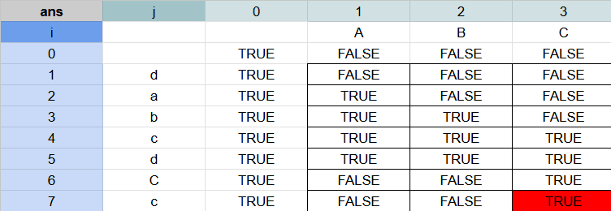

# [abbr](https://www.hackerrank.com/challenges/abbr/problem)

## NOTES

### If len(b) == 0

#### Case 1

[init]   a = ""   -> ans[0] = true

[step 1] a = "a"  -> ans[1] = ans[0] = true

[step 2] a = "aA" -> ans[2] = false

#### Case 2

[init]   a = ""   -> ans[0] = true

[step 1] a = "A"  -> ans[1] = false

[step 2] a = "Aa" -> ans[2] = ans[1] = false

### If len(b) > 0 then len(a) >= len(b)

#### Case len(a) = len(b)

[init]    a = ""   -> ans[0][0] = true

[init]    b = ""   -> ans[0][0] = true

[step 1]  a = "a"  -> ans[1][0] = ans[0][0] = true

[step 2]  b = "C"  -> ans[1][1] = false

[Step 3]  a = "aC" -> ans[2][1] = ans[1][0] = true

[Step 4]  b = "Cc" -> ans[2][2] = ans[2][1] = true
